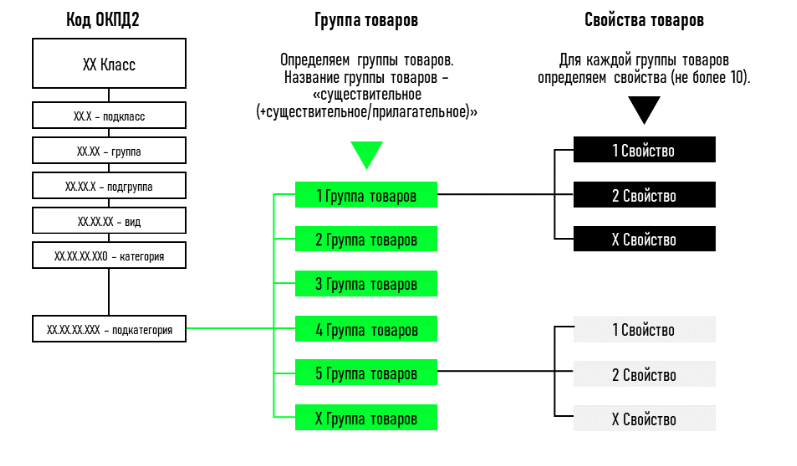

# Преобразовние каталога товаров ОАО "РЖД"
Решение кейса цифрового прорыва 2024 от [РЖД](https://hacks-ai.ru/events/1077380)

## **Задача**
В предоставленной базе данных выделить возможные категории товаров и получить их признаки из текстового описания, затем преобразовать исходный набор данных в параметрический.

### Первоначальные данные
- Справочник товаров
  - ED_IZM - что в ней?
  - GOST - что в ней?
  - **MTR - главная для нас таблица**
  - OKPD_2 - что в ней?
- Сайты для парсинга
- Тех. описание задачи в readme

### Возможный результат

<br/>

---
## Наше решение
Изучив предоставленные данные и возможные источники информации, мы приняли решение использвать парсинг сайтов, как вспомогательный инструмент для выделения параметров товаров. В дальнейшем используя значения этих параметров, мы кластеризовали товары по соотвествующих группам(наиболее схожим друг с другом).

### Алгоритм
&emsp;&emsp;**1**. Фильтруем данные и группируем по ОКПД2 для более удобного использования <br>
&emsp;&emsp;**2**. Составляем query(запрос) исходя из названия товара, его модели и т.д <br>
&emsp;&emsp;**3**. Ищем соответствующий товар или его ближайший аналог на [яндекс маркете](https://market.yandex.ru) <br>
&emsp;&emsp;**4**. Извлекаем возможные характеристики и фиксируем их в таблице <br>
&emsp;&emsp;**5**. Используем доступную нам LLM чтобы на основе текстовых данных получить конкретные значения этих характеристик <br>
&emsp;&emsp;**6**. Кластеризуем товары на новые группы на основе полученных данных

### Используемые технологии
  * **Selenium** для парсинга сайтов :zap:
  * **GigaChat** и ChatGPT как LLM :robot:
  * **Pandas**, **numpy**, **matplotlib**... для анализа данных :bar_chart:


> ### Почему Яндекс маркет?
> * ~3000 различных категорий и миллионы самих товаров
> * Скалируемое решение, которое удобно и недорого расширить на большое кол-во площадок
> * Реализуемое и проверяемое даже на данном этапе
---
### Файлы проекта
| Имя файла | Описание |
|---|---|
|[LLM_checked_df.csv](LLM_checked_df.csv)|Описание|
|[itog_data_from_pars.csv](itog_data_from_pars.csv)|Итоговые данные после парсинга|
|[parser.py](parser.py)|Сам паррсер|
|[Итоговый_ноутбук.ipynb](Итоговый_ноутбук.ipynb)|Описание|
|train_dataset_train ржд каталог.zip|Описание|
|user-agents.txt|User-agents для парсинга|
|requirements.txt|Файл с зависимостями|
```
# Установка зависимостей
pip install requrements.txt
```
